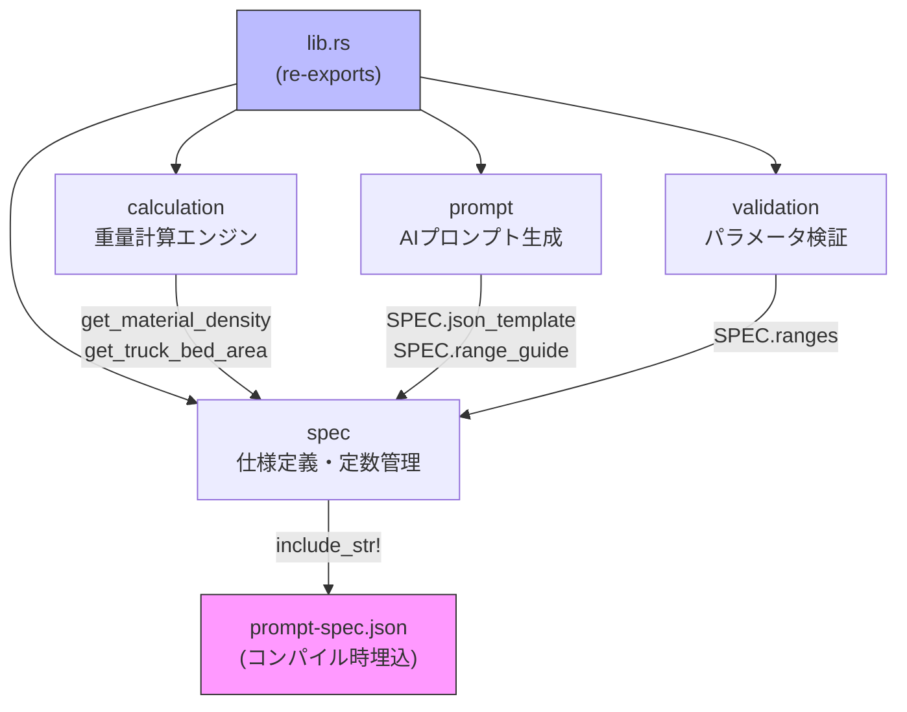
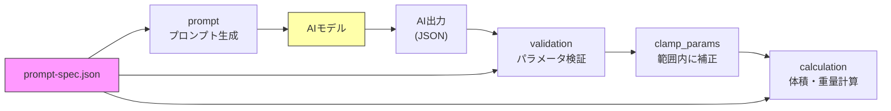

# tonsuu-core

ダンプトラックの積載重量推定のための共有コアライブラリ。
Rust (rlib) と WebAssembly (cdylib) の両ターゲットに対応。

## モジュール構成



## データフロー



## 計算式

```
bedArea     = truck_bed_length × truck_bed_width  (デフォルト: 6.8 m²)
upperAreaM2 = fillRatioW × bedArea
effHeight   = max(height, 0)
volume      = (upperAreaM2 + bedArea) / 2 × effHeight
tonnage     = volume × density × fillRatioZ × packingDensity
```

## モジュール詳細

### spec (`src/spec.rs`)

`prompt-spec.json` をコンパイル時に `include_str!()` で埋め込み、`LazyLock<PromptSpec>` でシングルトン化。全モジュールの定数供給源。

| 型 | 用途 |
|---|---|
| `PromptSpec` | トップレベル仕様コンテナ |
| `Ranges` | 全パラメータの範囲定義 |
| `Range` | min/max 境界値 |
| `HeightRange` | 高さ範囲 + キャリブレーション (後板0.30m, ヒンジ0.60m) |
| `Calculation` | 計算式パラメータ |
| `MaterialEntry` | 材質密度 (土砂1.8, As殻2.5, Co殻2.5, 開粒度As殻2.35) |
| `TruckSpec` | 車両寸法 (2t, 4t, 増トン, 10t) |

**公開関数:**

```rust
pub fn get_material_density(name: &str) -> f64       // 材質密度取得 (デフォルト: As殻 2.5)
pub fn get_truck_bed_area(truck_class: &str) -> f64   // 荷台面積取得 (デフォルト: 6.8m²)
pub fn default_bed_area() -> f64                       // デフォルト荷台面積
pub fn back_panel_height() -> f64                      // 後板高さ (0.30m)
pub fn hinge_height() -> f64                           // ヒンジ高さ (0.60m)
```

### calculation (`src/calculation.rs`)

重量計算の中核。

| 型 | 用途 |
|---|---|
| `CoreParams` | 計算入力 (fill_ratio_w, height, fill_ratio_z, packing_density, material_type) |
| `TonnageResult` | 計算出力 (volume, tonnage) |

**公開関数:**

```rust
pub fn calculate_tonnage(params: &CoreParams, truck_class: Option<&str>) -> TonnageResult
// WASM: calculateTonnage(fill_ratio_w, height, fill_ratio_z, ...) -> JSON string
```

### prompt (`src/prompt.rs`)

`prompt-spec.json` のテンプレートを展開してAIプロンプトを生成。

```rust
pub fn build_core_prompt() -> String        // メインプロンプト生成
pub fn range_guide() -> &'static str        // 範囲ガイド (日本語)
pub fn json_template_string() -> String     // JSONテンプレート (compact)
pub fn json_template_pretty() -> String     // JSONテンプレート (整形)
```

### validation (`src/validation.rs`)

AIが返したパラメータを `prompt-spec.json` の範囲で検証・補正。

| 型 | 用途 |
|---|---|
| `ValidationError` | エラー情報 (field, value, min, max, message) |
| `EstimationParams` | 検証対象パラメータ (全て `Option<f64>`) |

```rust
pub fn validate_params(params: &EstimationParams) -> Vec<ValidationError>
pub fn clamp_to_range(value: f64, min: f64, max: f64) -> f64
pub fn clamp_params(params: &EstimationParams) -> EstimationParams
```

## パラメータ範囲

| パラメータ | 最小 | 最大 | 備考 |
|---|---|---|---|
| height | 0.0 | 0.6 | 0.05mステップ, 後板=0.30m, ヒンジ=0.60m |
| fillRatioW | 0.0 | 0.9 | |
| fillRatioZ | 0.75 | 1.0 | |
| packingDensity | 0.5 | 0.9 | |

## 外部依存

| クレート | 用途 |
|---|---|
| `serde` / `serde_json` | JSON シリアライズ |
| `wasm-bindgen` (optional) | WebAssembly JSバインディング |

## 設計方針

1. **Single Source of Truth** — 全定数を `prompt-spec.json` で一元管理
2. **LazyLock** — 仕様のシングルトン遅延初期化
3. **WASM互換** — `#[cfg(feature = "wasm")]` による条件付きコンパイル
4. **型安全** — CoreParams / EstimationParams / TonnageResult の分離

---
*Auto-generated: 2026-02-08*
